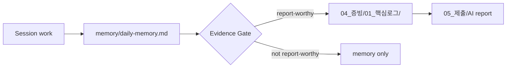
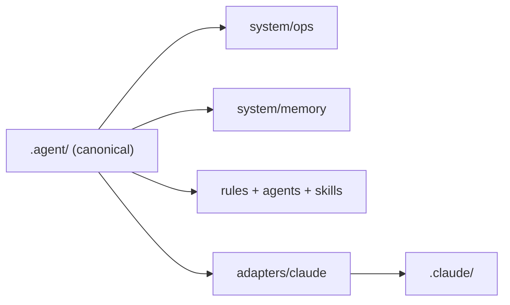

# Workspace Atlas

처음 보는 사용자는 이 파일 하나만 읽으면 현재 구조를 이해할 수 있어야 한다.

## 1. 구조 원칙

- `.agent/` = 운영 정본
- `.claude/` = Claude 런타임 어댑터
- `03_제품/` = 제품 정의와 실제 코드
- `04_증빙/` = AI 리포트 재료 정본
- 루트 = 사람용 색인과 대회 섹션

## 2. 현재 폴더 구조

```text
.
├── 00 HOME.md
├── 01_대회정보/
├── 02_전략/
├── 03_제품/
│   ├── app/
│   └── tests/
├── 04_증빙/
│   ├── 01_핵심로그/
│   ├── 02_분석자료/
│   └── 03_daily/
├── 05_제출/
├── assets/
├── .agent/
│   ├── AGENTS.md
│   ├── agents/
│   ├── rules/
│   ├── skills/
│   ├── adapters/
│   └── system/
│       ├── ops/
│       ├── contracts/
│       ├── memory/
│       ├── registry/
│       ├── maps/
│       ├── logs/
│       └── automation/
└── .claude/
    ├── commands/
    ├── CLAUDE.md
    ├── settings.json
    └── setup.sh
```

## 3. 어디를 읽어야 하는가

| 상황 | 먼저 읽을 파일 |
|---|---|
| 새 세션 시작 | `.agent/AGENTS.md` |
| 현재 할 일 확인 | `.agent/system/ops/PLAN.md` |
| 현재 상태 확인 | `.agent/system/ops/PROGRESS.md` |
| 오래 유지되는 사실 확인 | `.agent/system/memory/long-term-memory.md` |
| 오늘의 단기 맥락 확인 | `.agent/system/memory/daily-memory.md` |
| 로그 기록 위치 확인 | `04_증빙/_04_증빙_MOC.md` |

## 4. 메모리 → 증빙 흐름



## 5. 어댑터 구조



## 6. 구조가 바뀌면 무엇을 함께 바꾸는가

| 변경 유형 | 같이 갱신할 것 |
|---|---|
| 폴더 구조 변경 | 이 파일, `system-change-log.md`, `PROGRESS.md` |
| 운영 규칙 변경 | `workspace-contract.md`, `mirroring-policy.md` |
| 기억 변경 | `daily-memory.md`, 필요 시 `long-term-memory.md` |
| 리포트 가치 정보 발생 | `04_증빙/01_핵심로그/` |
| 세션 종료 | `04_증빙/01_핵심로그/session-log.md`, `04_증빙/01_핵심로그/ai-usage-log.md`, `evidence-gate-log.md` |
