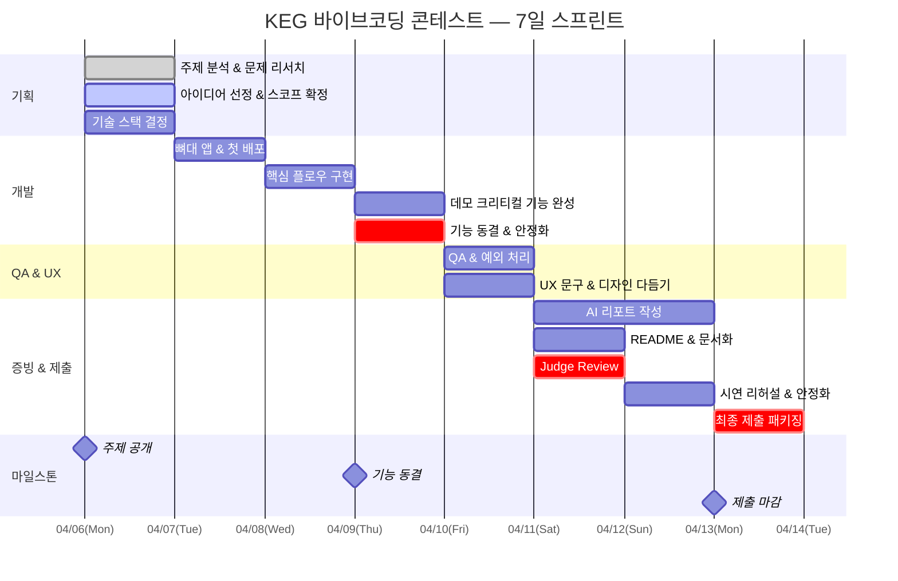
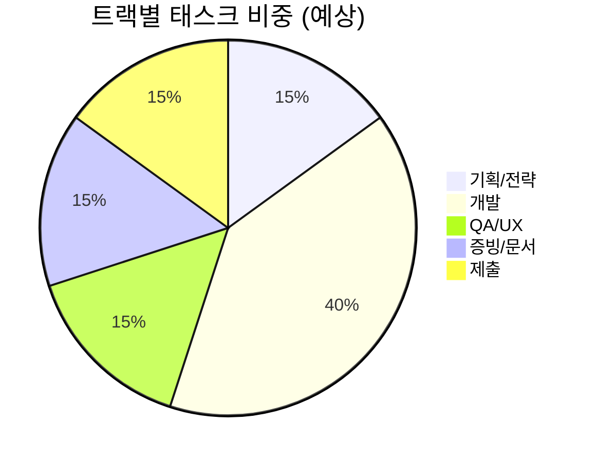

---
tags:
  - pm
  - dashboard
date: 2026-04-06
aliases:
  - PM대시보드
  - 프로젝트관리
---
# 프로젝트 매니저 대시보드

> 사용자용 가시 대시보드: [[_system/dashboard/project-dashboard|project-dashboard]]
> [[00 HOME|홈]] | [[.agent/system/ops/PLAN|PLAN]] | [[.agent/system/ops/PROGRESS|PROGRESS]] | [[_04_증빙_MOC|증빙]]

## 태스크 트래커

![[_system/dashboard/project-dashboard.base]]

---

## 간트차트 (7일 스프린트)



---

## 타임라인 — 일별 초점

| Day    | 날짜       | 초점                           | 데일리 종료 조건             | 상태  |
| ------ | -------- | ---------------------------- | --------------------- | --- |
| **D0** | 04-06(월) | 주제 분석, 문제 선택, 구조 확정          | 아이디어 1개 확정, 워크스페이스 완성 | 🔄  |
| **D1** | 04-07(화) | 뼈대 앱, 데이터 구조, 첫 배포           | 접속 가능한 배포본, 핵심 DB 스키마 | ⏳   |
| **D2** | 04-08(수) | 핵심 플로우 작동                    | 메인 시나리오 end-to-end 작동 | ⏳   |
| **D3** | 04-09(목) | 데모 크리티컬 완성, ==기능 동결==        | 데모 가능 상태, 새 기능 추가 금지  | ⏳   |
| **D4** | 04-10(금) | QA, 예외 처리, UX                | 핵심 시나리오 오류 0개         | ⏳   |
| **D5** | 04-11(토) | README, AI 리포트, Judge Review | 제출물 초안 완성             | ⏳   |
| **D6** | 04-12(일) | 시연 리허설, 안정화                  | 리허설 1회 이상, 치명 이슈 0개   | ⏳   |
| **D7** | 04-13(월) | ==기능 추가 금지==, 제출 패키징만        | **24:00 제출 완료**       | ⏳   |

### 매일 밤 필수 체크 (데일리 종료 조건)

- [ ] 접속 가능한 배포본
- [ ] 오늘 변경 기능 설명
- [ ] 스크린샷 3장 이상 (`assets/screenshots/`)
- [ ] AI 리포트 재료 기록 (`04_증빙/01_핵심로그/master-evidence-ledger.md`)
- [ ] 내일의 단일 목표

---

## 트랙별 진행률



---

## 리스크 레지스터

| ID | 리스크 | 영향 | 확률 | 대응 | 상태 |
|----|--------|------|------|------|------|
| R1 | 배포 실패 | 🔴 | 중 | Day 1에 첫 배포, Vercel/Netlify 검증 | 대기 |
| R2 | 스코프 과잉 | 🔴 | 높 | Day 3 기능 동결, scope-board.md | 대기 |
| R3 | AI 리포트 미완성 | 🟡 | 중 | Day 0부터 로그 자동 축적 | 진행중 |
| R4 | API Key 노출 | 🔴 | 낮 | .env 사용, QA 체크 | 대기 |
| R5 | 마감 직전 버그 | 🟡 | 중 | Day 3 기능 동결 → 안정화 집중 | 대기 |

---

## 팀 역할 배분

| 역할 | 이승보 (CEO) | 김주용 (COO) |
|------|-------------|-------------|
| 기획/전략 | ✅ 공동 | ✅ 공동 |
| SW 개발 | ✅ 주담당 | ✅ 보조 |
| AI 활용/프롬프트 | ✅ 공동 | ✅ 공동 |
| UX/디자인 | 보조 | ✅ 주담당 (심리학 배경) |
| 프로젝트 관리 | 보조 | ✅ 주담당 |
| 발표/데모 | 보조 | ✅ 주담당 |
| 문서/리포트 | ✅ 공동 | ✅ 공동 |

---

## 태스크 생성 가이드

태스크 노트를 만들 때 아래 frontmatter를 사용하면 `[[project-dashboard]]`의 `project-dashboard.base`에 자동 표시됩니다:

```yaml
---
tags:
  - task
status: todo          # todo / in-progress / blocked / done
priority: P0          # P0 / P1 / P2
track: 개발           # 기획 / 개발 / QA / 증빙 / 제출
owner: 이승보         # 이승보 / 김주용 / AI
day: 1                # 0~7
due: 2026-04-07       # YYYY-MM-DD
demo_critical: true   # true / false
---
```

### 예시: 태스크 노트

```markdown
---
tags: [task]
status: todo
priority: P0
track: 개발
owner: 이승보
day: 1
due: 2026-04-07
demo_critical: true
---
# 뼈대 앱 배포

## 설명
Next.js 앱 초기화 + Vercel 배포 + 도메인 연결

## 완료 조건
- [ ] 앱 초기화 완료
- [ ] Vercel 배포 성공
- [ ] URL 접속 가능
```

---

## 빠른 링크

- [[00 HOME|홈]] — 전체 색인
- [[_04_증빙_MOC|증빙]] — AI 사용 로그, 의사결정 기록
- [[_05_제출_MOC|제출]] — 제출물 준비
- [[바이브코딩공모전_공지|대회 개요서]] — 대회 규칙 전체
- [[vibe_contest_master_playbook_v0_1|마스터 플레이북]] — 전략 가이드
