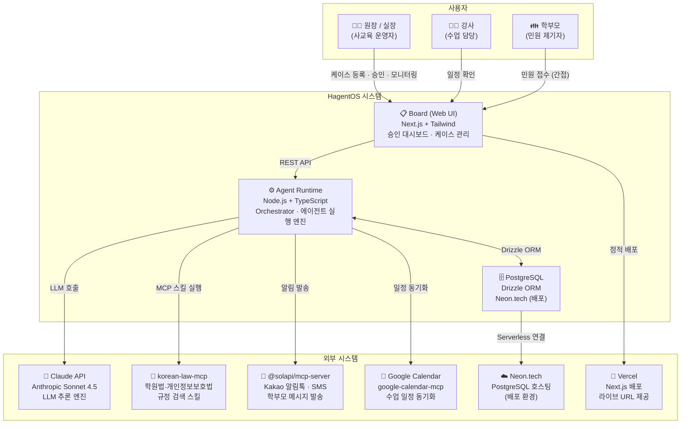

# System Context — HagentOS C4 Level 1

> 시스템 경계, 사용자, 외부 의존성을 한눈에 파악하는 컨텍스트 다이어그램.
> 기준 문서: [[02_product/prd]], [[07_integrations/integrations]]



---

## 시스템 경계 요약

| 영역 | 기술 | 역할 |
|------|------|------|
| Board (UI) | Next.js 14 + Tailwind + next-auth | 원장 인터페이스, 4존 레이아웃 |
| Agent Runtime | Node.js + TypeScript | 에이전트 실행, WakeupRequest dedup, k-skill 주입 |
| DB | PostgreSQL + Drizzle ORM | 모든 상태 영속화, 감사 추적 |
| LLM | Claude Sonnet 4.5 (claude-sonnet-4-5) | 초안 생성, 분류, 계획 |
| k-skill MCP | korean-law-mcp, solapi, gcal | 한국형 외부 기능 확장 |
| 배포 | Vercel + Neon.tech | 대회 제출용 라이브 URL |

## MVP 범위 (D5~D8)

```
In Scope:  Board + AgentRuntime + DB + Claude API
Deferred:  Solapi (알림), GCal 동기화 → v1.1
```
