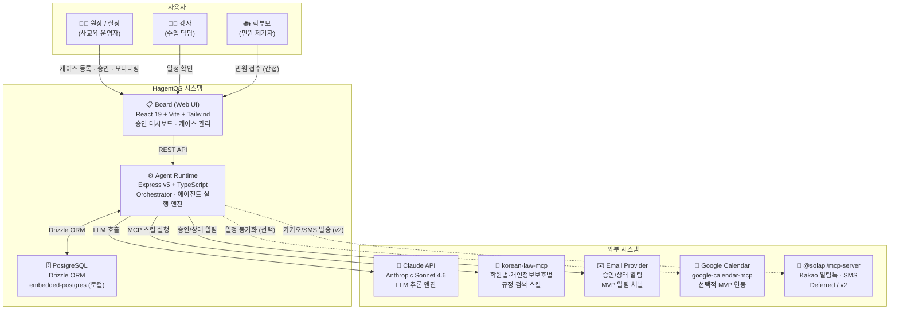

# System Context — HagentOS C4 Level 1

> 시스템 경계, 사용자, 외부 의존성을 한눈에 파악하는 컨텍스트 다이어그램.
> 기준 문서: [[02_product/prd]], [[07_integrations/integrations]]

## MVP 구현 경계

- `MVP Core`: Board, Agent Runtime, PostgreSQL, Claude API, in-app/email 알림
- `Optional in MVP demo`: Google Calendar
- `Deferred / v2`: Solapi Kakao/SMS, 기타 외부 MCP 실연



---

## 시스템 경계 요약

| 영역 | 기술 | 역할 |
|------|------|------|
| Board (UI) | React 19 + Vite + Tailwind | 원장 인터페이스, 4존 레이아웃 |
| Agent Runtime | Express v5 + TypeScript (ESM) | 에이전트 실행, WakeupRequest dedup, k-skill 주입 |
| DB | PostgreSQL + Drizzle ORM | 모든 상태 영속화, 감사 추적 |
| LLM | Claude Sonnet 4.6 | 초안 생성, 분류, 계획 |
| 알림 | in-app + email | MVP 기본 알림 채널 |
| k-skill MCP | korean-law-mcp, gcal(optional), solapi(v2) | 한국형 외부 기능 확장 |
| 배포 | GitHub 오픈소스 설치형 + 랜딩 페이지 | Paperclip 배포 모델 |

## MVP 범위 (D5~D8)

```
In Scope:  Board + AgentRuntime + DB + Claude API + in-app/email
Optional:  Google Calendar 연동
Deferred:  Solapi Kakao/SMS, 기타 외부 메시징
```
