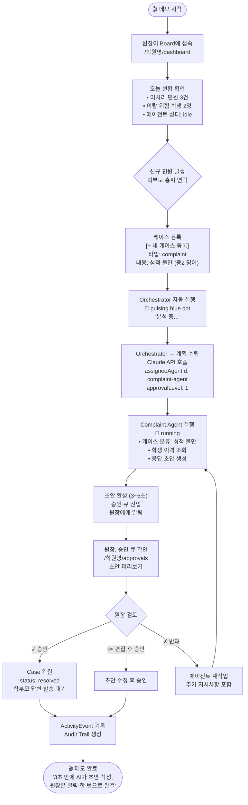
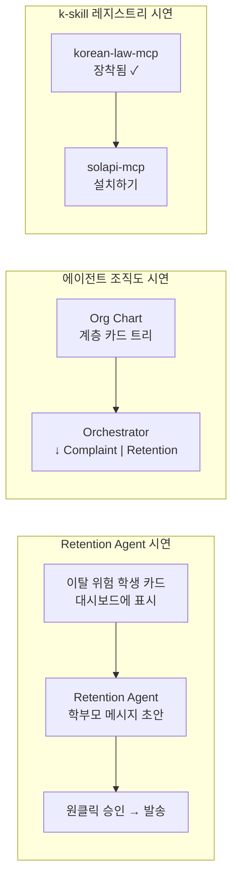

# Demo/User Flow — 2분 데모 시나리오

> "학부모 민원 접수 → AI 에이전트 초안 → 원장 원클릭 승인 → 완결"
> 대회 심사용 2분 데모 크리티컬 패스. 기준 문서: [[02_product/user-journeys]], [[05_workflows/complaint-handling]]

## 핵심 데모 흐름 (Happy Path)

---

## 데모 확장 흐름 (2분 이후 선택적 시연)

---

## 심사 포인트 대응

| 심사 기준 | 데모에서 보여줄 것 |
|-----------|-------------------|
| 기술적합성 30% | 에이전트 병렬 실행 + Claude API 실시간 호출 |
| 창의성 25% | "AI 팀" 개념 — 챗봇이 아닌 역할 기반 오케스트레이션 |
| 완성도 20% | 케이스 생성 → 승인 → 완결 전체 흐름 동작 |
| AI활용 15% | Orchestrator가 계획 수립 → 에이전트 배정 → 레벨 결정 |
| 팀워크 10% | 이승보(에이전트 로직) + 김주용(UI/인프라) 역할 분담 |
