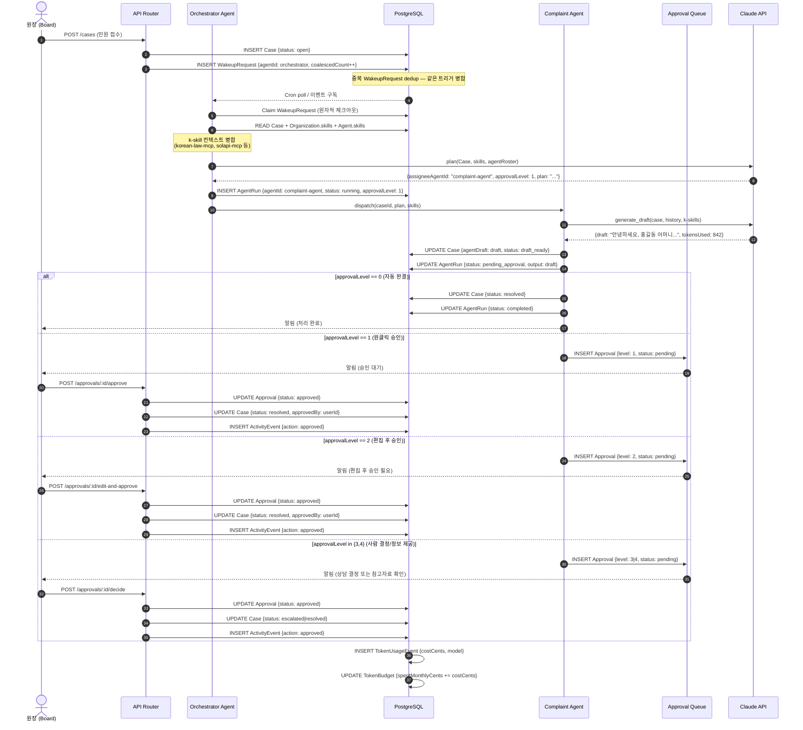

# Orchestrator Sequence — 에이전트 실행 파이프라인

> Trigger → WakeupRequest dedup → Orchestrator plan → Dispatch → k-skill 주입 → LLM Call → Level 분기 → 완결
> 기준 문서: [[04_ai-agents/agent-design]], [[04_ai-agents/agent-roles/orchestrator]]

---

## 트리거 유형 4종

| 트리거 | 예시 | invocationSource |
|--------|------|-----------------|
| 수동 등록 | 원장이 직접 케이스 생성 | `on_demand` |
| 자동 감지 | Retention Agent가 이탈 위험 감지 | `automation` |
| 크론 스케줄 | 매일 오전 8시 Heartbeat | `timer` |
| 과제 배정 | 원장이 에이전트에게 케이스 배정 | `assignment` |

## 승인 레벨 분기 요약

| Level | 행동 | 흐름 |
|-------|------|------|
| 0 | 분류·기록·집계 | AgentRun → completed (즉시) |
| 1 | 초안 발송 | Approval Queue → 원장 원클릭 |
| 2 | 편집 후 발송 | Approval Queue → 편집 후 승인 |
| 3 | 상담·개입 결정 | Approval Queue → 원장 액션 선택 |
| 4 | 정보 제공만 | Approval Queue → 참고자료 확인 후 수동 처리 |
