# ERD — HagentOS 핵심 도메인 모델

> Drizzle ORM + PostgreSQL 기준. 아래는 `MVP Core ERD`이며, Must 범위 테이블을 우선 표시한다.
> 전체 스키마 정본: [[08_data/domain-model]]

```mermaid
erDiagram
    Organization {
        uuid id PK
        text name
        enum type "academy|tutoring|public"
        jsonb profile
        text[] agents
        text[] skills
    }

    Agent {
        uuid id PK
        uuid organizationId FK
        text slug
        enum agentType "orchestrator|complaint|retention|scheduler|intake|staff|finance|compliance|notification|analytics"
        enum status "idle|running|pending_approval|paused|error"
        uuid reportsTo FK
        text[] skills
        int budgetMonthlyCents
        int spentMonthlyCents
    }

    AgentKey {
        uuid id PK
        uuid agentId FK
        uuid organizationId FK
        text keyHash
        text label
        timestamptz lastUsedAt
    }

    Case {
        uuid id PK
        uuid organizationId FK
        enum type "complaint|refund|makeup|inquiry"
        enum severity "low|medium|high|critical"
        enum status "open|draft_ready|pending_approval|resolved|escalated"
        uuid reporterId FK
        uuid studentId FK
        text agentDraft
        enum priority "urgent|high|medium|low"
        uuid parentId FK
        uuid goalId FK
        uuid checkoutRunId FK
    }

    AgentRun {
        uuid id PK
        uuid agentId FK
        uuid wakeupRequestId FK
        enum status "running|completed|failed|pending_approval"
        jsonb input
        jsonb output
        int tokensUsed
        int costCents
        int approvalLevel "0-4"
        enum invocationSource "timer|assignment|on_demand|automation"
    }

    WakeupRequest {
        uuid id PK
        uuid agentId FK
        text triggerType
        jsonb triggerPayload
        int coalescedCount
        timestamptz claimedAt
    }

    Approval {
        uuid id PK
        uuid agentRunId FK
        int level "0-4"
        enum status "pending|approved|rejected"
        uuid approvedBy
        timestamptz decidedAt
    }

    Parent {
        uuid id PK
        uuid organizationId FK
        text name
        text phone
        enum preferredChannel "kakao|sms|email"
    }

    Schedule {
        uuid id PK
        uuid organizationId FK
        enum type "class|consult|bus|inspection|legal_deadline|other"
        text title
        timestamptz startAt
        timestamptz endAt
        text externalSync
        enum status "scheduled|completed|cancelled|rescheduled"
    }

    Notification {
        uuid id PK
        uuid organizationId FK
        uuid caseId FK
        text type
        enum channel "in_app|email|kakao|sms"
        enum status "pending|sent|failed"
        uuid recipientId
    }

    OpsGroup {
        uuid id PK
        uuid organizationId FK
        text name
        text color
        enum status "active|archived"
        uuid leadAgentId FK
    }

    OpsGoal {
        uuid id PK
        uuid organizationId FK
        text title
        enum status "active|completed|cancelled"
        uuid parentId FK
        date targetDate
    }

    ActivityEvent {
        uuid id PK
        uuid organizationId FK
        enum entityType "case|agent|approval|skill|schedule"
        uuid entityId
        enum action "created|updated|deleted|approved|rejected|run_started|run_completed"
        uuid actorId
        enum actorType "user|agent"
        jsonb payload
    }

    TokenBudget {
        uuid id PK
        uuid organizationId FK
        uuid agentId FK
        int budgetMonthlyCents
        int spentMonthlyCents
        int warningThresholdPct "default 80"
        bool hardStop
    }

    TokenUsageEvent {
        uuid id PK
        uuid organizationId FK
        uuid agentId FK
        uuid agentRunId FK
        int inputTokens
        int outputTokens
        int costCents
        text model
    }

    Student {
        uuid id PK
        uuid organizationId FK
        text name
        text grade
        float riskScore "0-1, Retention Agent 갱신"
    }

    Organization ||--o{ Agent : "owns"
    Organization ||--o{ Case : "owns"
    Organization ||--o{ Parent : "owns"
    Organization ||--o{ Schedule : "owns"
    Organization ||--o{ Notification : "owns"
    Organization ||--o{ OpsGroup : "owns"
    Organization ||--o{ OpsGoal : "owns"
    Organization ||--o{ ActivityEvent : "logs"
    Organization ||--o{ TokenBudget : "has"

    Agent ||--o{ AgentRun : "executes"
    Agent ||--o{ AgentKey : "has"
    Agent ||--o{ WakeupRequest : "wakes"
    Agent |o--o| Agent : "reportsTo"

    WakeupRequest ||--o{ AgentRun : "triggers"
    AgentRun ||--o| Approval : "gates"
    AgentRun ||--o{ TokenUsageEvent : "incurs"

    Case }o--o| Student : "concerns"
    Case }o--o| Parent : "reportedBy"
    Case }o--o| OpsGoal : "links"
    Case |o--o| AgentRun : "checkoutRun"
    Case |o--o| Case : "parentId"
    Case ||--o{ Notification : "emits"
    Schedule ||--o{ Notification : "reminds"
```

---

## MVP Core vs Extended

### MVP Core (바로 구현 기준)

`Organization`, `Agent`, `WakeupRequest`, `AgentRun`, `Case`, `Approval`, `Student`, `Parent`, `Schedule`, `Notification`

### Extended (v1.1+ / 운영 확장)

`AgentKey`, `OpsGroup`, `OpsGoal`, `ActivityEvent`, `TokenBudget`, `TokenUsageEvent`

---

## MVP 필수 테이블 (D5~D6 스프린트)

| 우선순위 | 테이블 | 이유 |
|---------|--------|------|
| Must | Organization | 멀티테넌시 루트 |
| Must | Agent | 에이전트 영속 엔티티 |
| Must | WakeupRequest | 에이전트 wakeup dedup / claim |
| Must | Case | 민원 케이스 |
| Must | AgentRun | 실행 감사 추적 |
| Must | Approval | 승인 게이트 |
| Must | Parent | 민원 제기자 연결 |
| Must | Schedule | 통합 스케줄러 |
| Must | Notification | 인앱/이메일 알림 저장 |
| Should | Student | 이탈 위험 점수 |
| Should | TokenBudget | API 예산 관리 |
| Later | OpsGroup / OpsGoal | v1.1 |
