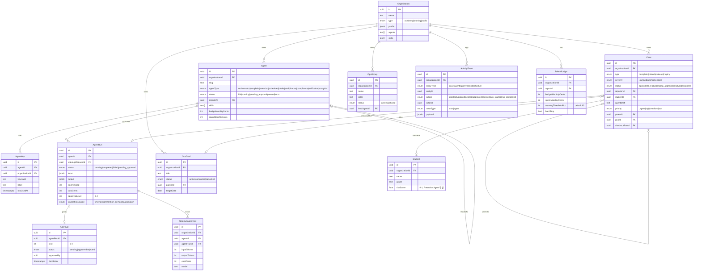

# ERD — HagentOS 핵심 도메인 모델

> Drizzle ORM + PostgreSQL 기준. 핵심 12개 테이블.
> 전체 스키마 정본: [[08_data/domain-model]]

---

## MVP 필수 테이블 (D5~D6 스프린트)

| 우선순위 | 테이블 | 이유 |
|---------|--------|------|
| Must | Organization | 멀티테넌시 루트 |
| Must | Agent | 에이전트 영속 엔티티 |
| Must | Case | 민원 케이스 |
| Must | AgentRun | 실행 감사 추적 |
| Must | Approval | 승인 게이트 |
| Should | Student | 이탈 위험 점수 |
| Should | TokenBudget | API 예산 관리 |
| Later | OpsGroup / OpsGoal | v1.1 |
