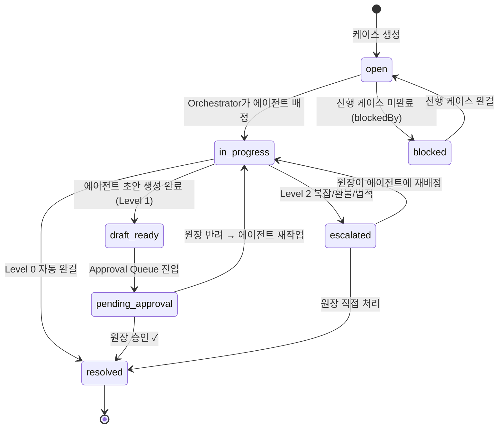
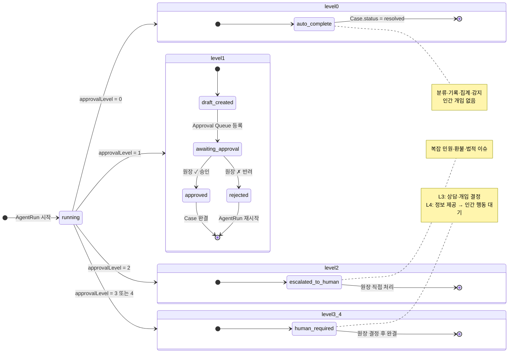

# Approval State — 승인 상태 머신

> Case 상태와 AgentRun 승인 레벨 흐름을 통합한 상태 다이어그램.
> 기준 문서: [[08_data/domain-model]], [[04_ai-agents/agent-roles/complaint]], [[04_ai-agents/agent-roles/retention]]

## Case 상태 머신

---

## AgentRun 승인 레벨별 흐름

---

## 레벨 × 에이전트 대응표

| 에이전트 | 행동 | Level | 결과 |
|----------|------|:-----:|------|
| Complaint | 민원 분류 + 로그 | **0** | 자동 완결 |
| Complaint | 일반 응답 초안 | **1** | 원클릭 승인 |
| Complaint | 복잡/환불/법적 | **2** | 에스컬레이션 |
| Retention | 위험 점수 + 대시보드 | **0** | 자동 완결 |
| Retention | 학부모 안내 메시지 | **1** | 원클릭 승인 |
| Retention | 상담/개입 결정 | **3** | 원장 결정 |
| Scheduler | 일정 자동 업데이트 | **0** | 자동 완결 |
| Scheduler | 강사 대체 제안 | **1** | 원클릭 승인 |
