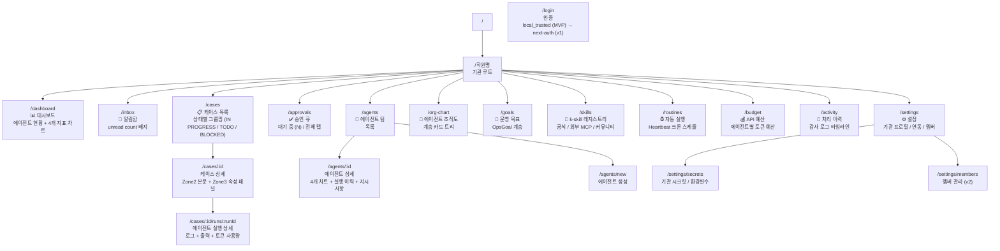
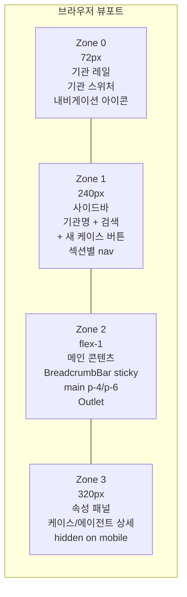

# IA / Screen Map — 정보 아키텍처

> 22개 라우트 계층 구조 + 4존 레이아웃 요약.
> 기준 문서: [[09_ux/information-architecture]], [[_research/paperclip-ui-reference]]

## 라우트 계층 맵



---

## 4존 레이아웃



**모바일**: Zone 0+1 → z-50 fixed overlay (스와이프). Zone 3 → 숨김. 하단 탭바 5개 고정.

---

## 사이드바 섹션 구조

```
기관명 [로고]          [🔍]
[+ 새 케이스 등록]    ← 최상단 CTA

대시보드              [• 1 live]
알림함                [3]

─ WORK ──────────────────────────
  케이스
  자동 실행           [Beta]
  운영 목표

─ 운영 영역 ────────────────── [+]
  • 학부모 커뮤니케이션
  • 이탈 방어
  • 일정 관리

─ 에이전트 팀 ──────────────── [+]
  ○ 오케스트레이터    [• 1 live]
  ○ 민원 담당
  ○ 이탈 방어
  ○ 스케줄 담당

─ 기관 관리 ─────────────────────
  조직도
  k-skill 레지스트리
  API 예산
  처리 이력
  설정

─ (footer) ──────────────────────
  v0.1.0  [docs]  [⚙️]  [🌙/☀️]
```

---

## MVP 화면 우선순위

| 우선순위 | 라우트 | 이유 |
|---------|--------|------|
| **Must** | `/dashboard` | 진입점 + 에이전트 현황 |
| **Must** | `/cases` | 케이스 목록 |
| **Must** | `/cases/:id` | 케이스 상세 + 에이전트 실행 결과 |
| **Must** | `/approvals` | 원클릭 승인 흐름 |
| **Must** | `/agents/:id` | 에이전트 상태 모니터링 |
| Should | `/org-chart` | 데모 임팩트 |
| Should | `/skills` | k-skill 생태계 시연 |
| Later | `/budget`, `/activity` | v1.1 |
