# HagentOS 종합 아키텍처 — 한눈에 보는 전체 모델

> AI 리포트 제출용 핵심 모델링 다이어그램.
> 사용자 계층부터 외부 MCP 생태계까지 6계층을 하나의 그림에 집약.
> Obsidian에서 렌더 → 우클릭 "이미지 저장" → `assets/screenshots/99_comprehensive-architecture.png`

---

## 전체 아키텍처 + 데이터 흐름 (6 계층)

```mermaid
flowchart TB
    subgraph L1["👥 사용자 계층"]
        direction LR
        원장["🧑‍💼 원장<br/>한 줄 지시 + 1-click 승인"]
        강사["👩‍🏫 강사<br/>일정 확인"]
        학부모["👪 학부모<br/>카카오 민원 접수"]
        심사위원["🏆 심사위원<br/>데모 체험"]
    end

    subgraph L2["🖥️ UI 계층 (React 19 + Vite + TypeScript)"]
        direction LR
        Dashboard["📊 대시보드"]
        Cases["📋 케이스 관리"]
        Approvals["✅ 승인 큐"]
        Agents["🤖 에이전트 팀"]
        Schedule["📅 통합 스케줄"]
        Skills["🔧 k-skill 레지스트리"]
        Settings["⚙️ 설정"]
    end

    subgraph L3["⚙️ 서버 계층 (Express + TypeScript ESM)"]
        direction TB
        Router["REST API Router<br/>/cases /agents /approvals /skills"]
        subgraph AgentTeam["🤖 멀티에이전트 팀"]
            direction LR
            Orchestrator["🧠 오케스트레이터<br/>케이스 분석·배정"]
            Complaint["💬 민원담당<br/>답변 초안"]
            Retention["📉 이탈방어<br/>위험 탐지"]
            Scheduler["🗓️ 스케줄러<br/>일정 최적화"]
        end
        Runtime["Runtime Adapter<br/>OpenAI / Anthropic / Codex"]
        ApprovalQueue["승인 큐<br/>Level 0~4"]
    end

    subgraph L4["💾 데이터 계층 (Neon PostgreSQL + Drizzle ORM)"]
        direction LR
        OrgDB[("Organization")]
        AgentDB[("Agent<br/>+ systemPrompt<br/>+ memory<br/>+ adapterConfig")]
        CaseDB[("Case<br/>+ status<br/>+ assignee<br/>+ agentDraft")]
        SkillDB[("Skill<br/>+ mount<br/>+ context")]
        RunDB[("AgentRun<br/>+ tokensUsed<br/>+ cost")]
        ActivityDB[("ActivityEvent<br/>감사 로그")]
    end

    subgraph L5["🧩 k-skill 생태계 (한국 교육 특화 15종)"]
        direction LR
        RefundCalc["환불 계산기<br/>학원법 제18조"]
        ToneGuide["한국어 톤 가이드"]
        ChurnCalc["이탈 위험 계산기"]
        LawLookup["법령 조회<br/>law.go.kr"]
        ComplaintClass["민원 분류기"]
        Student360["학생 360° 뷰"]
        ReEnroll["재등록 플레이북"]
        OtherSkills["...8개 추가"]
    end

    subgraph L6["🌐 외부 시스템"]
        direction LR
        OpenAI["🤖 OpenAI<br/>GPT-4o-mini<br/>Chat Completions"]
        Claude["🤖 Anthropic<br/>Claude Sonnet 4.6"]
        KakaoCh["💬 카카오 채널<br/>inbound/outbound"]
        Telegram["💬 텔레그램 봇"]
        SMS["📱 Aligo SMS"]
        GCal["📅 Google Calendar MCP"]
        LawMCP["📜 korean-law-mcp"]
        Railway["☁️ Railway 배포"]
        Neon["🗄️ Neon Postgres"]
    end

    %% 주 흐름: 사용자 → UI → 서버 → AI → 응답
    원장 --> Dashboard
    학부모 -->|"카카오 메시지"| KakaoCh
    KakaoCh -->|"inbound 파싱"| Router
    강사 --> Schedule
    심사위원 --> Dashboard

    Dashboard --> Router
    Cases --> Router
    Approvals --> Router
    Agents --> Router
    Schedule --> Router
    Skills --> Router
    Settings --> Router

    Router --> Orchestrator
    Orchestrator -->|"역할 매칭"| Complaint
    Orchestrator -->|"역할 매칭"| Retention
    Orchestrator -->|"역할 매칭"| Scheduler

    Complaint --> Runtime
    Retention --> Runtime
    Scheduler --> Runtime
    Orchestrator --> Runtime

    Runtime -->|"LLM 호출"| OpenAI
    Runtime -.->|"fallback"| Claude

    Complaint -.->|"k-skill 로드"| RefundCalc
    Complaint -.->|"k-skill 로드"| ToneGuide
    Complaint -.->|"k-skill 로드"| ComplaintClass
    Complaint -.->|"k-skill 로드"| LawLookup
    Retention -.->|"k-skill 로드"| ChurnCalc
    Retention -.->|"k-skill 로드"| Student360
    Retention -.->|"k-skill 로드"| ReEnroll
    Scheduler -.->|"k-skill 로드"| OtherSkills

    LawLookup <-->|"MCP protocol"| LawMCP
    Scheduler <-->|"MCP protocol"| GCal

    Complaint --> ApprovalQueue
    Retention --> ApprovalQueue
    Scheduler --> ApprovalQueue
    ApprovalQueue -->|"승인 대기 알림"| 원장
    원장 -->|"1-click 승인"| ApprovalQueue
    ApprovalQueue -->|"승인됨"| KakaoCh
    ApprovalQueue -->|"승인됨"| Telegram
    ApprovalQueue -->|"승인됨"| SMS

    Router <-->|"Drizzle ORM"| OrgDB
    Orchestrator <-->|"Drizzle ORM"| AgentDB
    Complaint <-->|"Drizzle ORM"| CaseDB
    Retention <-->|"Drizzle ORM"| CaseDB
    Scheduler <-->|"Drizzle ORM"| CaseDB
    Runtime -->|"기록"| RunDB
    Router -->|"감사"| ActivityDB
    SkillDB <-.-> AgentDB

    OrgDB -.-> Neon
    AgentDB -.-> Neon
    CaseDB -.-> Neon
    RunDB -.-> Neon
    ActivityDB -.-> Neon
    SkillDB -.-> Neon

    Router -.->|"배포"| Railway

    %% 스타일링
    classDef userStyle fill:#FFE4B5,stroke:#8B4513,stroke-width:2px,color:#000
    classDef uiStyle fill:#B0E0E6,stroke:#4682B4,stroke-width:2px,color:#000
    classDef serverStyle fill:#98FB98,stroke:#228B22,stroke-width:2px,color:#000
    classDef agentStyle fill:#DDA0DD,stroke:#8B008B,stroke-width:2px,color:#000
    classDef dataStyle fill:#F0E68C,stroke:#808000,stroke-width:2px,color:#000
    classDef skillStyle fill:#FFB6C1,stroke:#DC143C,stroke-width:2px,color:#000
    classDef externalStyle fill:#D3D3D3,stroke:#696969,stroke-width:2px,color:#000

    class 원장,강사,학부모,심사위원 userStyle
    class Dashboard,Cases,Approvals,Agents,Schedule,Skills,Settings uiStyle
    class Router,Runtime,ApprovalQueue serverStyle
    class Orchestrator,Complaint,Retention,Scheduler agentStyle
    class OrgDB,AgentDB,CaseDB,SkillDB,RunDB,ActivityDB dataStyle
    class RefundCalc,ToneGuide,ChurnCalc,LawLookup,ComplaintClass,Student360,ReEnroll,OtherSkills skillStyle
    class OpenAI,Claude,KakaoCh,Telegram,SMS,GCal,LawMCP,Railway,Neon externalStyle
```

---

## 다이어그램 읽는 법 (심사위원용 1분 가이드)

1. **맨 위 (오렌지)**: 사용자 4종 — 원장(주사용자) · 강사 · 학부모 · 심사위원(데모 체험)
2. **2단 (하늘)**: UI 계층 — 7개 핵심 페이지 (React 19)
3. **3단 (녹색+보라)**: 서버 + 에이전트 팀 — 오케스트레이터 1 + 전문 에이전트 3
4. **4단 (노랑)**: 데이터 계층 — Neon PostgreSQL에 6개 도메인 테이블
5. **5단 (분홍)**: k-skill 생태계 — 한국 교육 특화 스킬 15종
6. **맨 아래 (회색)**: 외부 시스템 — LLM API·메시징 채널·MCP 서버·인프라

### 핵심 흐름 3가지

| 흐름 | 경로 |
|------|------|
| **원장 지시** | 원장 → Dashboard → Router → Orchestrator → 역할 에이전트 → OpenAI → k-skill → 승인 큐 → 원장 승인 → 메시지 채널 |
| **학부모 민원** | 학부모 → 카카오 → Router(inbound 파싱) → Orchestrator → 민원담당 → 답변 초안 → 승인 큐 |
| **자동화 루틴** | Cron → Orchestrator → 이탈방어/스케줄러 → 자동 리포트 → 원장 인박스 |

---

## 렌더링 방법 (PNG 내보내기)

1. **Obsidian에서 이 파일 열기**
2. 읽기 모드(`Ctrl/Cmd + E`) 전환하면 mermaid 자동 렌더
3. 다이어그램 위에서 **우클릭 → "Save image as..."**
4. 저장 위치: `assets/screenshots/99_comprehensive-architecture.png`
5. AI 리포트 Q2 또는 Q5에 삽입

### 대안: mermaid.live 온라인 렌더
- https://mermaid.live/ 접속
- 위 코드블록을 붙여넣기
- 우측 상단 "Actions → PNG" 내보내기
