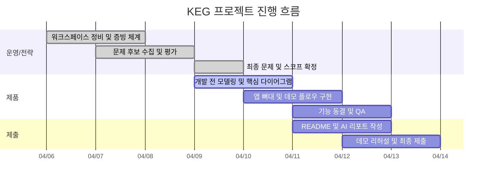

---
tags:
  - area/system
  - type/dashboard
  - status/active
date: 2026-04-10
up: "[[00 HOME]]"
aliases:
  - project-dashboard
  - 프로젝트대시보드
---
# 프로젝트 대시보드

> 사용자와 AI가 함께 보는 가시 대시보드 정본.
> 숨김 `.agent/` 내부가 아니라 Obsidian에서 바로 보이는 위치에 둔다.

## 현재 상태

- 현재 단계: Day 5, `전략 구조 정리 + 운영 문서 동기화 + 제출용 이미지 증빙 정리 완료`
- 다음 단계: `앱 스켈레톤 착수`와 `최소 데모 플로우 구현`으로 전환한다.
- 아직 실제 앱 코드는 초기화되지 않았다. 따라서 `03_제품/`은 기획 정본을 기준으로 앱 구조를 첫 실행 가능한 상태로 옮겨야 하는 단계다.
- 지금 대시보드는 `PLAN`, `PROGRESS`, `daily`, `master-evidence-ledger`, `type/task` note를 한 화면에서 잇는 제출용 진행판 역할을 맡는다.

## 현재 집중 산출물

- `System Context Diagram` — HagentOS, 사용자, 외부 MCP/캘린더/알림 경계 정의
- `Demo/User Flow` — 온보딩 → 한 줄 지시 → 병렬 실행 → 승인 → 일정 반영
- `Orchestrator Sequence Diagram` — Frontend, API, Orchestrator, Agent, DB 상호작용 고정
- `Domain Model / ERD` — Institution, Agent, TaskRun, ApprovalItem, Complaint, Student, ScheduleEvent 구조 정의
- `Approval State Diagram` — 실행, 검토, 승인, 반려, 후속 액션 상태 전이 정리

## 제출용 일정 개요

## 운영 로그 연결

- [[.agent/system/ops/PLAN|PLAN]] — 오늘 기준 우선순위와 마일스톤
- [[.agent/system/ops/PROGRESS|PROGRESS]] — 실제 완료/진행 상태
- [[master-evidence-ledger]] — 세션 단위 증빙 원장
- [[decision-log]] — 중요한 구조 결정
- [[prompt-catalog]] — 재사용 프롬프트 자산
- [[2026-04-06]] / [[2026-04-07]] / [[2026-04-08]] / [[2026-04-09]] / [[2026-04-10]] — 일별 작업 스냅샷

## 새 파일/폴더를 만든 이유

- `02_전략/tasks/` — 전략 후보 축소와 문제 확정 작업을 `type/task`로 추적하기 위해 추가
- `02_전략/00_foundation/`, `01_problem-framing/`, `02_prompts/`, `03_decisions/` — 전략 루트에 섞여 있던 기준 문서, 프롬프트, 의사결정 문서를 역할별로 분리하기 위해 추가
- `04_증빙/tasks/` — 제출용 진행 증빙 정리를 task로 관리하기 위해 추가
- `06_LLM위키/tasks/` — 전략 문서를 wiki layer로 ingest하는 반복 작업을 분리하기 위해 추가
- `04_증빙/03_daily/2026-04-07.md`, `2026-04-08.md` — 빠진 일일 기록을 복원해 날짜별 증빙 공백을 메우기 위해 추가
- `02_전략/paperclip-analysis/paperclip-master/` — 실제 reference 프로그램 코드를 로컬에 두고 구조를 해체 분석하기 위해 추가
- `02_전략/paperclip-analysis/06-runtime-control-plane-map.md`, `07-plugin-adapter-extensibility.md` — chat imitation이 아니라 control plane 구조와 확장 구조를 기준으로 모방 포인트를 고정하기 위해 추가
- `02_전략/archive/web-captures/` — 전략 정본이 아닌 웹 저장본과 캡처를 분리 보관하기 위해 추가
- `탄자니아 영어학원` 로고/카카오 채널 이미지 제목 정리 — 제출용 증빙 삽입 시 장면 설명을 바로 재사용하기 위해 추가

## 태스크 트래커

![[project-dashboard.base]]

## 규칙

- `PLAN`은 앞으로 할 일을, `PROGRESS`는 실제 상태를, 이 대시보드는 제출용 가시화 판을 맡는다.
- 세 문서는 같은 날짜 기준으로 함께 갱신한다. 셋 중 하나만 바뀌면 진행 상황이 왜곡된다.
- 태스크 note는 `type/task` 태그와 frontmatter를 맞춰야 여기에 뜬다.
- day가 바뀌면 `daily`, `PLAN`, `PROGRESS`, `master-evidence-ledger`를 먼저 맞춘 뒤 대시보드를 본다.

- 대시보드 구조를 바꾸면 [[workspace-atlas]]와 관련 운영 문서를 같이 본다.
- AI 운영 note는 `.agent/system/ops/`에 둘 수 있지만, 사람이 직접 보는 대시보드는 이 note를 기준으로 한다.
