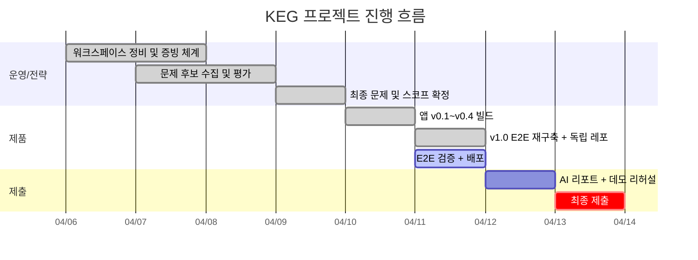

---
tags:
  - area/system
  - type/dashboard
  - status/active
date: 2026-04-11
up: "[[00 HOME]]"
aliases:
  - project-dashboard
  - 프로젝트대시보드
---
# 프로젝트 대시보드

> 사용자와 AI가 함께 보는 가시 대시보드 정본.
> 숨김 `.agent/` 내부가 아니라 Obsidian에서 바로 보이는 위치에 둔다.

## 현재 상태

- **현재 단계**: Day 6 (2026-04-11) — E2E 실동작 완성, 독립 레포 구축 완료
- **제품 상태**: HagentOS v1.0 — `River-181/hagent-os` (public), 포트 3200/5174
- **다음 액션**: E2E 검증 → Railway 배포 → 라이브 URL → AI 리포트 초안
- **마감**: 2026-04-13 24:00 **(D-2)**

## 핵심 지표

| 항목           | 상태                    |
| ------------ | --------------------- |
| 독립 레포        | ✅ River-181/hagent-os |
| E2E 재구축      | ✅ 서버+UI+Mock 완료       |
| DB 마이그레이션    | ✅ 직접 SQL 실행 완료        |
| 온보딩 플로우      | ✅ 4단계 Paperclip 방식    |
| 승인/거절 동작     | ✅ reject rollback 포함  |
| 멀티 학원 지원     | ✅ OrganizationRail    |
| E2E 브라우저 검증  | ⬜ 서버 재시작 후 필요         |
| 배포 (라이브 URL) | ⬜ Railway 설정 필요       |
| AI 리포트       | ⬜ 초안 착수 필요            |
| 데모 스크립트      | ⬜ 2분 시연 경로 미작성        |

## 현재 집중 산출물

- **HagentOS v1.0 독립 레포** — `River-181/hagent-os` (E2E 실동작, 온보딩, 멀티학원)
- **Paperclip 갭 분석** — `03_제품/PAPERCLIP-GAP-ANALYSIS.md`
- **E2E 검증** — 온보딩 → dispatch → 케이스 → approvals → OrgChart
- **배포** — Railway + Neon.tech (라이브 URL 필수)
- **AI 리포트** — `04_증빙/01_핵심로그/` raw material 기반 2섹션

## 제출용 일정 개요

## 운영 로그 연결

- [[.agent/system/ops/PLAN|PLAN]] — 오늘 기준 우선순위와 마일스톤
- [[.agent/system/ops/PROGRESS|PROGRESS]] — 실제 완료/진행 상태
- [[master-evidence-ledger]] — 세션 단위 증빙 원장
- [[decision-log]] — 중요한 구조 결정
- [[prompt-catalog]] — 재사용 프롬프트 자산
- [[2026-04-06]] / [[2026-04-07]] / [[2026-04-08]] / [[2026-04-09]] / [[2026-04-10]] / [[2026-04-11]] — 일별 작업 스냅샷

## 주요 구조 변경 이력

- `02_전략/tasks/`, `00_foundation/`, `01_problem-framing/`, `02_prompts/`, `03_decisions/` — 전략 문서 역할별 분리
- `02_전략/paperclip-analysis/paperclip-master/` — reference 코드 로컬 해체 분석
- `03_제품/PAPERCLIP-GAP-ANALYSIS.md` — 14개 갭 P0/P1/P2 분류 (2026-04-11 신규)
- `/Users/river/workspace/active/hagent-os/` — 독립 설치형 레포 분리 (2026-04-11)

## 태스크 트래커

![[project-dashboard.base]]

## 규칙

- `PLAN`은 앞으로 할 일을, `PROGRESS`는 실제 상태를, 이 대시보드는 제출용 가시화 판을 맡는다.
- 세 문서는 같은 날짜 기준으로 함께 갱신한다. 셋 중 하나만 바뀌면 진행 상황이 왜곡된다.
- 태스크 note는 `type/task` 태그와 frontmatter를 맞춰야 여기에 뜬다.
- day가 바뀌면 `daily`, `PLAN`, `PROGRESS`, `master-evidence-ledger`를 먼저 맞춘 뒤 대시보드를 본다.
- 대시보드 구조를 바꾸면 [[workspace-atlas]]와 관련 운영 문서를 같이 본다.
- AI 운영 note는 `.agent/system/ops/`에 둘 수 있지만, 사람이 직접 보는 대시보드는 이 note를 기준으로 한다.
