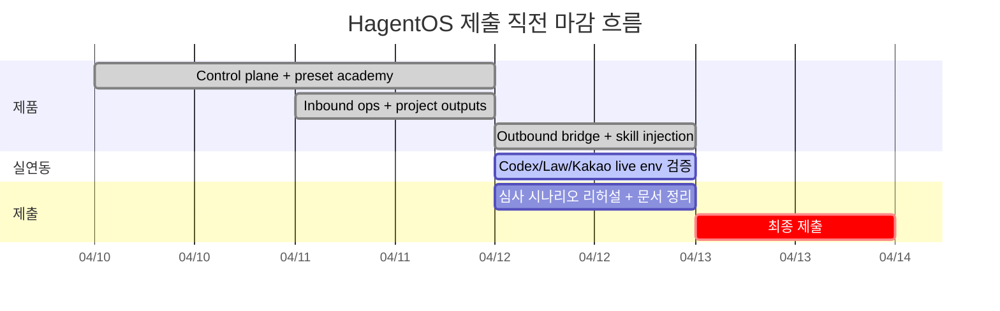

---
tags:
  - area/system
  - type/dashboard
  - status/active
date: 2026-04-13
up: "[[00 HOME]]"
aliases:
  - project-dashboard
  - 프로젝트대시보드
---
# 프로젝트 대시보드

> 제출 직전 기준 가시 대시보드 정본
> 기준 제품: `/Users/river/workspace/active/hagent-os`

## 현재 상태

- **현재 단계**: 2026-04-13 — 라이브 배포 완료, 제출 패키지 마감 단계
- **제품 상태**: `HagentOS`는 `Kakao/Telegram inbound -> case -> approval -> document` 루프, `issue/properties UI`, `schedule polish`, `students/settings 안정화`, `telegram approval/outbound`, `운영 요약 패널 확장`, `judge/public deploy split 설계`, `Railway live deploy`까지 반영된 상태
- **현재 제품 위치**: `/Users/river/workspace/active/hagent-os`
- **라이브 URL**: `https://hagent-os.up.railway.app`
- **다음 액션**: `ai-report-final -> docx/PDF`, `개인정보동의서/참가각서 서명`, `제출 이메일 발송`
- **마감 인식**: 새 기능 추가보다 `제출 정본 고정 + 항법 단순화 + 증빙 패키징`이 더 중요

## 제출 내비게이션

- [[00 HOME|HOME]]
- [[_05_제출_MOC|05 제출 MOC]]
- [[05_제출/ai-report-final|AI report final]]
- [[03_제품/hagent-os/diagrams/99_comprehensive-architecture|99 comprehensive architecture]]
- [[assets/excaildraw-/01_민원-처리-플로우.excalidraw|Excalidraw 01]] / [[assets/excaildraw-/02_AI-협업-구조.excalidraw|02]] / [[assets/excaildraw-/03_시스템-4계층.excalidraw|03]]
- [[.agent/system/ops/RALPH-LOOP-2026-04-13|RALPH Loop]]

## 핵심 지표

| 항목 | 상태 |
|---|---|
| Scratch onboarding | ✅ |
| Demo academy preset | ✅ Tanzania English Academy |
| Kakao inbound | ✅ |
| Telegram inbound | ✅ |
| Case / Approval / Document loop | ✅ |
| Project from instruction | ✅ |
| Mounted skill runtime injection | ✅ |
| Kakao operator bridge | ✅ |
| 제품 위계 재정렬 1차 | ✅ |
| 우측 운영 요약 패널 | ✅ 핵심 페이지 반영 |
| issue/properties UI 정리 | ✅ |
| schedule interaction polish | ✅ 1차 |
| students/settings stabilization | ✅ 1차 |
| telegram approval/outbound | ✅ |
| telegram fallback demo channel | ✅ |
| judge/public deploy split plan | ✅ |
| Railway live deploy | ✅ `https://hagent-os.up.railway.app` |
| Telegram public bot | ✅ `https://t.me/TANZANIA_ENGLISH_ACADEMY_bot` |
| Kakao public channel | ✅ `https://pf.kakao.com/_raDdX` |
| Codex live | ⬜ `OPENAI_API_KEY` 필요 |
| Korean law live | ⬜ `LAW_OC` 필요 |
| Kakao auto send | ⬜ provider env 필요 |
| Google Calendar live | ⬜ token 필요 |

## 실연동 readiness

### 준비 완료
- `codex_local` adapter test UI/API
- `korean-law-mcp` 연결 경로
- `kakao inbound`
- `kakao outbound operator bridge`
- `skill runtime injection`

### 아직 env 필요
- `OPENAI_API_KEY`
- `LAW_OC`
- optional `KAKAO_OUTBOUND_PROVIDER_URL`
- optional `GOOGLE_CALENDAR_ACCESS_TOKEN`

## 현재 재검증 상태

- `corepack pnpm --filter @hagent/ui typecheck` ✅
- `corepack pnpm --filter @hagent/ui build` ✅
- `corepack pnpm --filter @hagent/db build` ✅
- `corepack pnpm --filter @hagent/server typecheck` ✅
- `curl http://127.0.0.1:3200/api/health` ✅ `200`
- `curl http://127.0.0.1:5174/탄자니아-영어학원-데모-7/dashboard` ✅ `200`

## 현재 증빙/로그 위치

- Live app: `https://hagent-os.up.railway.app`
- GitHub: `https://github.com/River-181/hagent-os`
- Railway: `https://railway.com/invite/fmzuFpxK1li`
- Neon DB: `https://console.neon.tech/app/projects/rough-feather-95020200`
- Telegram bot: `https://t.me/TANZANIA_ENGLISH_ACADEMY_bot`
- Kakao channel: `https://pf.kakao.com/_raDdX`
- `/Users/river/workspace/active/hagent-os/.playwright-cli/page-2026-04-12T21-42-48-976Z.png`
- `/Users/river/workspace/active/hagent-os/.playwright-cli/page-2026-04-12T21-47-05-413Z.yml`
- `/Users/river/workspace/active/hagent-os/docs/handoff/2026-04-13-d1-verification.md`
- `/Users/river/workspace/active/hagent-os/docs/handoff/2026-04-13-full-regression.md`
- `/Users/river/workspace/active/hagent-os/docs/handoff/2026-04-13-master-evidence.md`

## 미검증 / 회귀 위험

- `Telegram outbound` 실제 외부 사용자 기기 수신은 현재 세션에서 재검증하지 않았다.
- `LAW_OC`, `OPENAI_API_KEY`, `KAKAO_OUTBOUND_PROVIDER_URL`, `GOOGLE_CALENDAR_ACCESS_TOKEN` live env는 여전히 미검증이다.
- `hagent-os` working tree가 dirty라서 commit 전 최종 regression이 필요하다.

## 심사 시나리오 4개

### 1. 카카오 민원 접수
- inbound
- complaint run
- approval
- document
- outbound send 또는 operator bridge

### 2. 보강/결석 문의
- inbound
- scheduler run
- approval
- 일정 제안
- calendar sync 또는 pending status

### 3. 상반기 프로모션 준비
- project from instruction
- child cases
- outputs
- 추천 역할/agent hire

### 4. 법률/운영 정책 질문
- assistant 질문 입력
- inquiry case 생성
- 브리프 문서 생성
- `LAW_OC` 유무에 따라 live 또는 degraded 설명

## 남은 마일스톤

1. `AI 리포트 docx -> PDF` 완료
2. `개인정보동의서 / 참가각서` 서명 완료
3. 제출 이메일 발송
4. `Codex live` 검증
5. `LAW_OC` 넣고 법령 요약 검증
6. `Kakao outbound`를 auto 또는 bridge 기준으로 시연 확정

## 현재 집중 산출물

- `/Users/river/workspace/active/hagent-os`
- `03_제품/hagent-os/_research/gap-analysis-paperclip-vs-hagent.md`
- `03_제품/hagent-os/10_execution/runtime-docs/handoff/2026-04-13-full-regression.md`
- `Tanzania English Academy` demo preset
- `Kakao/Telegram replay shortcut`
- `학생 / 직원·강사 / 일정 / 문서 / AI 팀` 우측 운영 요약 패널
- `오늘 운영 / 학원 운영 / AI 운영 / 운영 관리` 좌측 내비 구조

## 제출용 일정 개요

## 운영 로그 연결

- `03_제품/hagent-os/10_execution/roadmap.md`
- `03_제품/hagent-os/10_execution/runtime-docs/handoff/2026-04-13-full-regression.md`
- `03_제품/hagent-os/_research/gap-analysis-paperclip-vs-hagent.md`

## 규칙

- 이 대시보드는 `현재 실제 동작`만 기록한다.
- `env 없음`과 `미구현`을 섞어 쓰지 않는다.
- 제출 전에는 `live env`, `outbound`, `심사 시나리오` 3축만 본다.
