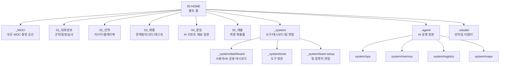
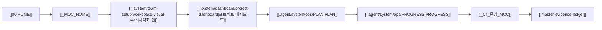
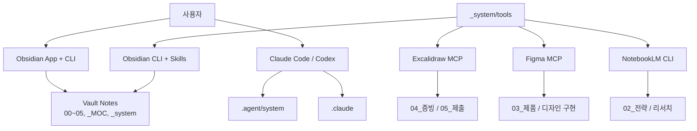
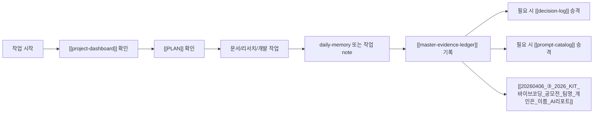

---
tags:
  - area/system
  - type/guide
  - status/active
date: 2026-04-06
up: "[[_system_tools_MOC]]"
aliases:
  - workspace-visual-map
  - 워크스페이스시각화맵
---
# 워크스페이스 시각화 맵

> 처음 보는 사용자는 이 note부터 보면 된다.
> 이 문서는 이 워크스페이스의 구조, 읽는 순서, 도구 계층, 운영 흐름을 시각화한다.

## 1. 전체 구조

## 2. 처음 보는 사용자의 읽는 순서

## 3. 도구 계층

## 4. 운영 흐름

## 5. 어디에 무엇을 기록하는가

| 상황              | 기록 위치                      |
| --------------- | -------------------------- |
| 대회 규칙/공지 이해     | [[_01_대회정보_MOC]]           |
| 전략, 리서치, 플레이북   | [[_02_전략_MOC]]             |
| 제품 구조, 코드, 테스트  | [[_03_제품_MOC]]             |
| AI 활용 증빙, 세션 재료 | [[master-evidence-ledger]] |
| 중요한 의사결정        | [[decision-log]]           |
| 반복 사용 프롬프트      | [[prompt-catalog]]         |
| 도구 셋업과 팀 환경     | [[_system_tools_MOC]]      |

## 6. 핵심 원칙

- MOC는 `_MOC/`에만 둔다.
- 사용자와 AI가 같이 보는 대시보드는 `[[_system/dashboard/project-dashboard|project-dashboard]]`다.
- 직접 입력 증빙 정본은 [[master-evidence-ledger]] 하나다.
- 도구 정본은 `_system/tools/`에 둔다.
- 팀원 컴퓨터 적용 기준은 [[_system/team-setup/team-computer-setup-guide|팀 컴퓨터 셋업 가이드]]다.
